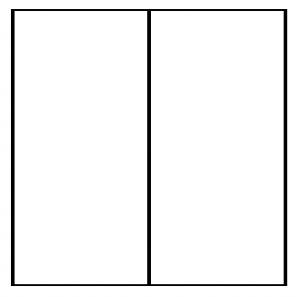

# css-workout
 By training on the css features, I make it possible to use it all the time.

> ### Normalize.css
A modern, HTML5-ready alternative to CSS resets <br>
Normalize.css makes browsers render all elements more consistently and in line with modern standards. It precisely targets only the styles that need normalizing. If you want to take a look, you can check: [Normalize.css](https://necolas.github.io/normalize.css/) <br>
So I used normalize.css to get the same output in all browsers.

> ## 5 Ways to Center a Div in CSS  

> ### 1. Using flexbox



```html
#index.html

<!DOCTYPE html>
<html lang="en">
<head>
    <meta charset="UTF-8">
    <meta http-equiv="X-UA-Compatible" content="IE=edge">
    <meta name="viewport" content="width=device-width, initial-scale=1.0">
    <title>Using flexbox</title>
    <link rel="stylesheet" href="styles.css">
    <link rel="stylesheet" href="normalize.css">
</head>
<body>
    <div class="parent">
        <div class="parent"></div>
        <div class="parent"></div>
    </div>
</body>
</html>
```

```css
#styles.css

/*Using flexbox*/

.parent {
    width: 200px;
    height: 200px;
    border: 1px solid;
    display: flex;
    justify-content: center;
    align-items: center;
}
```

> ### 2. Using grid


```html
#index.html

<!DOCTYPE html>
<html lang="en">
<head>
   <meta charset="UTF-8">
   <meta http-equiv="X-UA-Compatible" content="IE=edge">
   <meta name="viewport" content="width=device-width, initial-scale=1.0">
   <title>Using grid</title>
   <link rel="stylesheet" href="styles.css">
   <link rel="stylesheet" href="normalize.css">
</head>
<body>
   <div class="parent">
       <div class="child"></div>
       <div class="child"></div>
   </div>
</body>
</html>
```

```css
#styles.css

/*Using grid*/

.parent {
    width: 200px;
    height: 200px;
    border: 1px solid;
}

.child {
    width: 50px;
    height: 50px;
    border: 1px solid;
    display: grid;
    place-content: center;
}
```

> ### 3. Using position


```html
#index.html

<!DOCTYPE html>
<html lang="en">
<head>
   <meta charset="UTF-8">
   <meta http-equiv="X-UA-Compatible" content="IE=edge">
   <meta name="viewport" content="width=device-width, initial-scale=1.0">
   <title>Using flexbox</title>
   <link rel="stylesheet" href="styles.css">
   <link rel="stylesheet" href="normalize.css">
</head>
<body>
   <div class="parent">
       <div class="child"></div>
       <div class="child"></div>
   </div>
</body>
</html>
```

```css
#styles.css

/*Using position*/

.parent {
    width: 200px;
    height: 200px;
    border: 1px solid;
    position: relative;
}

.child {
    width: 50px;
    height: 50px;
    border: 1px solid;
    position: absolute;
    top: 50%;
    left:50%;
    transform: translate(-50%, -50%);
}
```

> ### 4. Using flex & margin


```html
#index.html

<!DOCTYPE html>
<html lang="en">
<head>
   <meta charset="UTF-8">
   <meta http-equiv="X-UA-Compatible" content="IE=edge">
   <meta name="viewport" content="width=device-width, initial-scale=1.0">
   <title>Using flex & margin</title>
   <link rel="stylesheet" href="styles.css">
   <link rel="stylesheet" href="normalize.css">
</head>
<body>
   <div class="parent">
       <div class="child"></div>
       <div class="child"></div>
   </div>
</body>
</html>
```

```css
#styles.css

/*Using flex & margin*/

.parent {
    width: 200px;
    height: 200px;
    border: 1px solid;
    display: flex;
}

.child {
    width: 50px;
    height: 50px;
    border: 1px solid;
    margin: auto;
}
```

> ### 5. Using grid & margin


```html
#index.html

<!DOCTYPE html>
<html lang="en">
<head>
   <meta charset="UTF-8">
   <meta http-equiv="X-UA-Compatible" content="IE=edge">
   <meta name="viewport" content="width=device-width, initial-scale=1.0">
   <title>Using grid & margin</title>
   <link rel="stylesheet" href="styles.css">
   <link rel="stylesheet" href="normalize.css">
</head>
<body>
   <div class="parent">
       <div class="child"></div>
       <div class="child"></div>
   </div>
</body>
</html>
```

```css
#styles.css

/*Using grid & margin*/

.parent {
    width: 200px;
    height: 200px;
    border: 1px solid;
    display: grid;
}

.child {
    width: 50px;
    height: 50px;
    border: 1px solid;
    margin: auto;
}
```
---

> ## CSS Combinator Selectors

> ### 1. Descendant Selector


```html
#index.html

<!DOCTYPE html>
<html lang="en">
<head>
   <meta charset="UTF-8">
   <meta http-equiv="X-UA-Compatible" content="IE=edge">
   <meta name="viewport" content="width=device-width, initial-scale=1.0">
   <title>Descendant Selector</title>
   <link rel="stylesheet" href="styles.css">
   <link rel="stylesheet" href="normalize.css">
</head>
<body>
   <div class="container">
        <h1>Lorem</h1>
        <h2>Ipsum</h2>
        <h3>Dolor</h3>
        <h4>Sit</h4>
        <h5>Amet</h5>
        <h6>Consectetur</h6>
   </div>
</body>
</html>
```

```css
#styles.css

/*Descendant Selector*/

.container h3 {
    border: 1px solid black;
    max-width: 50px;
    text-align: center;
    background-color: bisque;
}
```

> ### 2. Adjacent Sibling Selector


```html
#index.html

<!DOCTYPE html>
<html lang="en">
<head>
   <meta charset="UTF-8">
   <meta http-equiv="X-UA-Compatible" content="IE=edge">
   <meta name="viewport" content="width=device-width, initial-scale=1.0">
   <title>Adjacent Sibling Selector</title>
   <link rel="stylesheet" href="styles.css">
   <link rel="stylesheet" href="normalize.css">
</head>
<body>
   <div class="container">
        <h3>Lorem</h3>
        <h3>Ipsum</h3>
    </div>
    <h3>Dolor</h3>
    <h3>Sit</h3>
    <h3>Amet</h3>
    <h3>Consectetur</h3>
</body>
</html>
```

```css
#styles.css

/*Adjacent Sibling Selector*/

div + h3 {
    border: 1px solid black;
    max-width: 50px;
    text-align: center;
    background-color: thistle;
}
```


